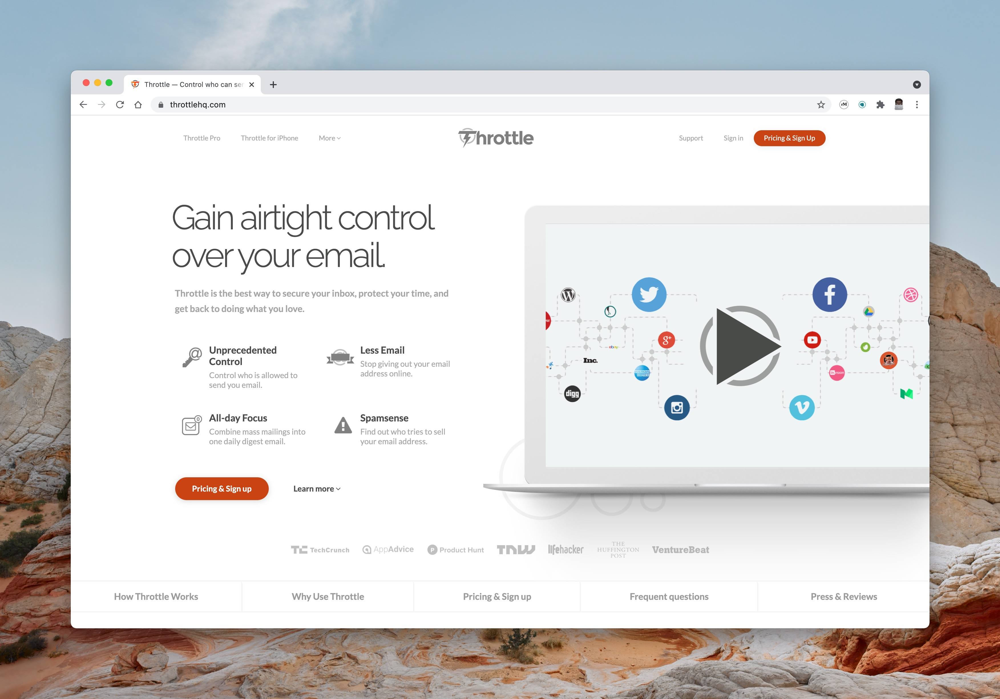
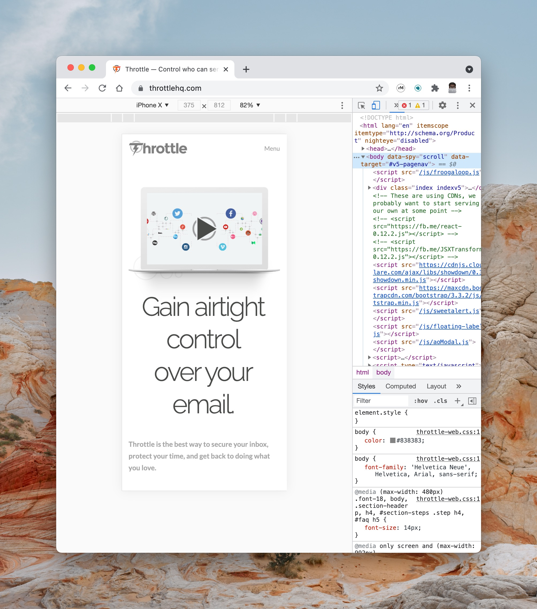

# GUI Apps Critque

### Quin'darius Lyles-Woods

> Prepared for Sarah North

#### Task at hand

I will be giving two examples of good and two examples of bad GUI design feautures.

## The Good

#### Remarkable

- The way that the product is able to reproduce the feel of paper is remarkable, hence the name, so great texture within the device screen.
- The product is very lightweight allowing it to mimick a small notebook for the users which allow it to be closer to a paper replacement.
- The pen is tilt and pressure sensentive allowing to to replicate and the feel of a real pen and the software allows it to mimick many different writing materials.

- The software isn't more miminalist than anything focusing on a few features so it does't overload the user.
- The software sticks to being a paper replacement and tries to stay away from trying to be a computer replacement, so the GUI doesn't confuse but keeps things dead simple.
- The features it does have that arent in normal notebooks are well thought out.
  - different writing devices
  - layers on the paper
  - send document as an email

#### Throttle Website

- This is choosen only for the look of the website, which is clean with massive spacial awareness of the compnents.
- The way the page takes advantage of pagination to give users a single view with all the import points of the service in one glance.
- Tells you what the product is about, both visual and in the words and the color scheme doesnt overwhelm you but has subtle touchs that pop out at you.

- When we go to the mobile view, on has to simply appreciate the attention to detail. We are on vindicated on the authors effort on pagination as they do it so well in a mobile view as well.
- Showing what the product is about so quickly without overwhelming the site vistor.
- The awareness of the user being on mobile and giving limited information is so apprecitated.

## The Bad

#### Berkshire Hathaway Inc Website

- A multi-billion dollar franchaise without ever a specified font. There is minimalism and there is tribalistic and this website could have tried to be minimalistic but looked careless in the process.

#### Yale School of Art Website

- This website, while it may be making an artisic statement is not easily readable.
- The Color Scheme is lacking and sprodic.
- The elements have no sense of padding around the background to make them look like their own entities.
